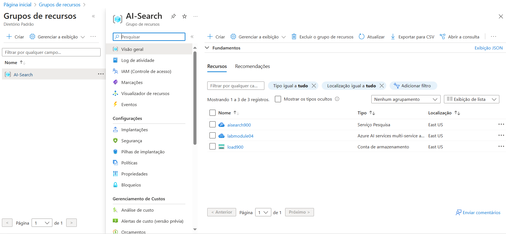
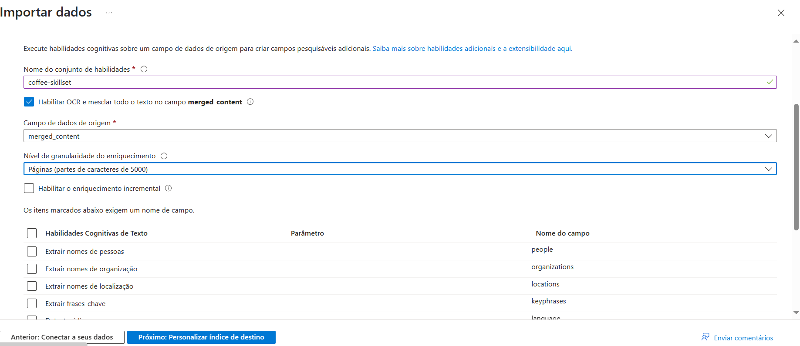
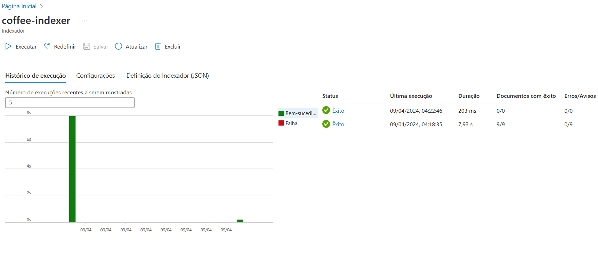
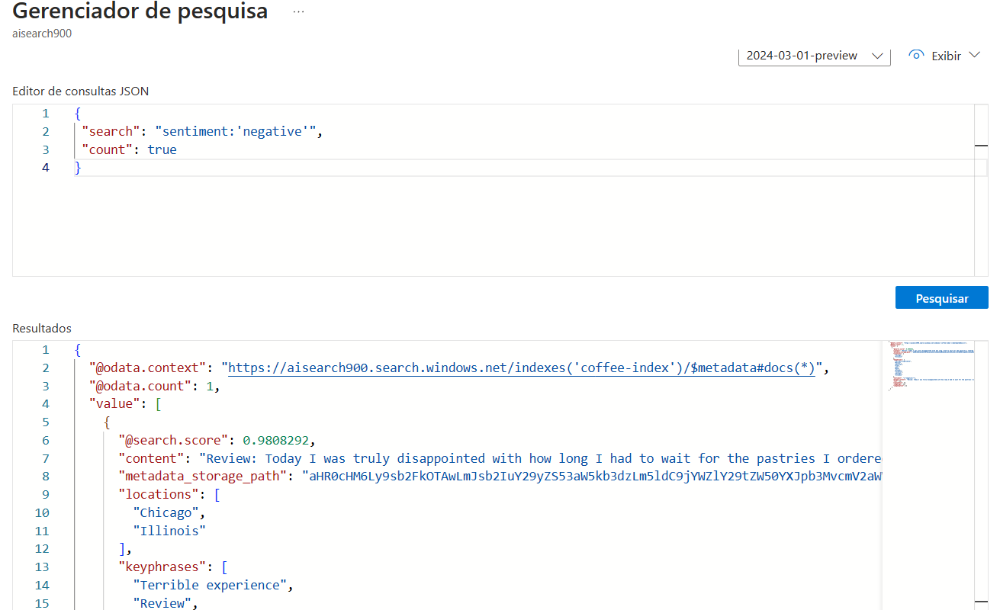

# Pesquisa de IA do Azure 🔍👁

**Cenário de Uso**:
 
  O desafio descreve um cenário onde você trabalha para a cadeia de cafeterias Fourth Coffee e precisa construir uma solução de mineração de conhecimento para pesquisar insights sobre experiências de clientes usando um índice de pesquisa AI do Azure com dados de avaliações de clientes.

**Recursos Necessários**:
 
  São necessários recursos específicos na sua assinatura do Azure, incluindo um recurso de serviços AI do Azure localizado na mesma região que o recurso de pesquisa AI do Azure.

**Importação de Dados**: 

Utiliza-se o assistente de importação de dados no portal do Azure para criar automaticamente um índice e um indexador para fontes de dados suportadas, importando documentos de pesquisa do armazenamento para o índice de pesquisa AI do Azure.

**Explorador de Pesquisa**: 

O Explorador de Pesquisa é uma ferramenta integrada ao portal do Azure que permite validar a qualidade do seu índice de pesquisa, onde você pode escrever e testar consultas e revisar resultados em JSON.

Esses são os pontos-chave abordados no lab e [documento disponibilizado](https://microsoftlearning.github.io/mslearn-ai-fundamentals/Instructions/Labs/11-ai-search.html), que destacam o processo de criação de uma solução de pesquisa inteligente utilizando os serviços AI do Azure. 

Aqui estão alguns insights possíveis:

- **Mineração de Conhecimento**: Utilizar análises de dados extraídos de avaliações de clientes para melhorar a experiência do consumidor.
- **Serviços Azure AI**: Provisionar recursos de IA no Azure para enriquecer dados com insights gerados por IA.
- **Importação de Dados**: Criar um índice de pesquisa no Azure AI Search e importar documentos usando um assistente de importação de dados.
- **Explorador de Pesquisa**: Testar e validar a qualidade do índice de pesquisa através do Explorador de Pesquisa no portal Azure.

Esses pontos destacam a capacidade de extrair informações valiosas de grandes conjuntos de dados e a importância de ferramentas de IA na otimização de processos de negócios.